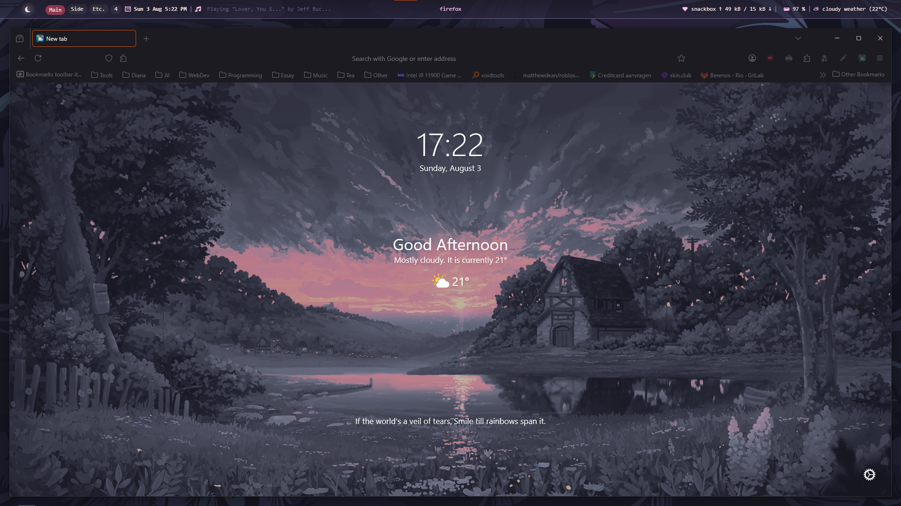
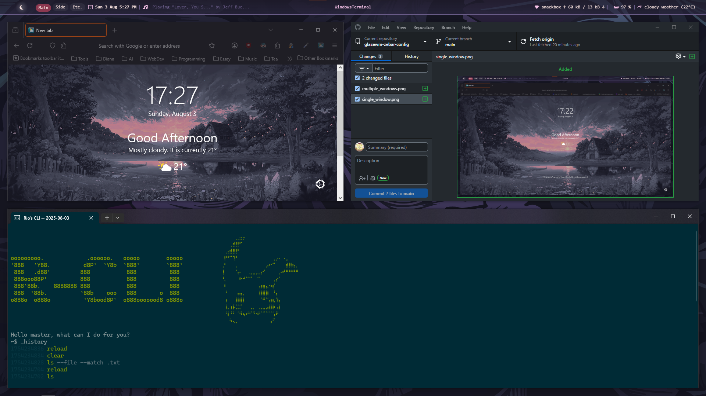

# glazewm-zebar-config

My personal config for GlazeWM and Zebar.
For personal use (feel free to check it out though).

Requires: Zebar 2.6+

## Bar

## Background

## Windows with GlazeWM

**Single window**

**Multiple windows**

